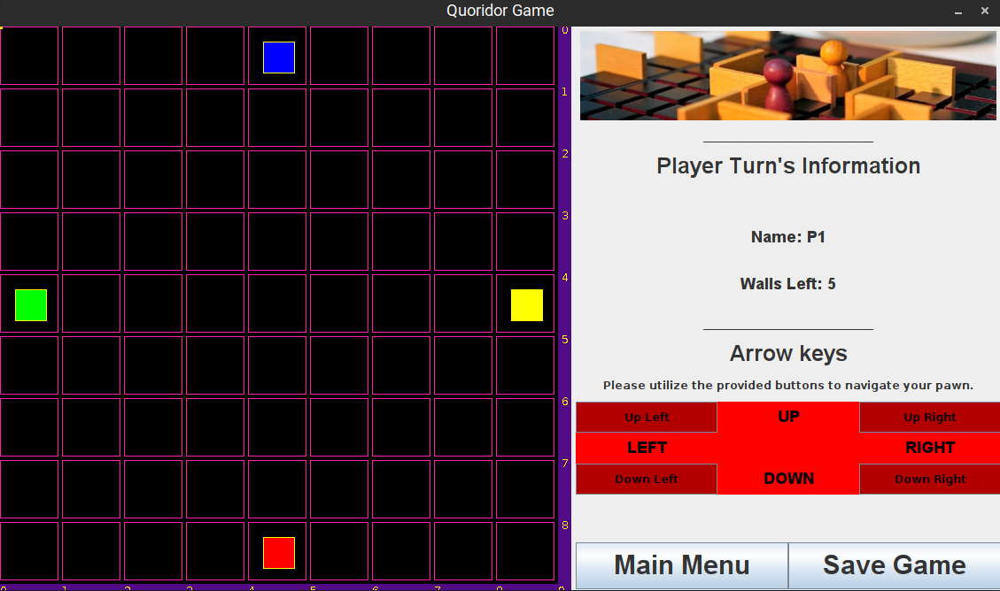
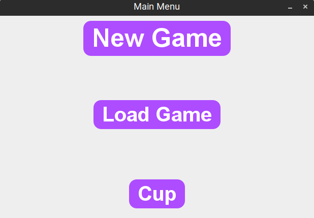

# Quoridor Game

Welcome to the Quoridor Game, a Java implementation of the popular board game Quoridor. The game features a graphical
user interface (GUI) where players can compete against each other on a virtual game board. The project provides an
engaging and strategic gaming experience for 2 to 4 players, including cup tournaments with 4 or 8 players.

## Table of Contents

- [Introduction](#introduction)
- [Installation](#installation)
- [Game Rules](#game-rules)
- [Features](#features)
- [Game Modes](#game-modes)
- [Cup Tournaments](#cup-tournaments)

## Introduction

Quoridor is a strategy board game designed for 2 to 4 players. The objective of the game is to navigate your pawn to the
opposite side of the game board while strategically placing walls to block your opponents. This implementation of
Quoridor offers an interactive and visually appealing experience through its GUI.

In this implementation of Quoridor, I offer an interactive and visually captivating experience through a Graphical User
Interface (GUI). With its user-friendly interface and intuitive gameplay

## Installation

To play the Quoridor Game on your local machine, follow these steps:

1. Ensure you have Java Development Kit (JDK) installed on your system.
2. Clone or download the project repository from
   GitHub: [GitHub Repo Link](https://github.com/MojTabaa4/quoridor-game.git)
3. Open the project in your preferred Java Integrated Development Environment (IDE).
4. Download the JSON.simple library for Java to handle JSON data. Follow these steps to download the library from Maven:

    - Open your project in IntelliJ IDEA or a similar IDE.
    - Navigate to the main menu and select "File" and then "Project Structure" (you can use the shortcut
      Ctrl+Alt+Shift+S).
    - In the Project Structure dialog, click on "Libraries" on the left-hand side.
    - Click on the "+" icon to add a new library.
    - Select "From Maven" from the dropdown menu.
    - In the search field, enter "com.github.cliftonlabs:json-simple:3.1.0" as the library artifact.
    - Click on the "Search" button.
    - Once the library is found, click on the "OK" button to download and add it to your project.

5. Compile and run the `QuoridorMain.java` file to start the game.

By following these steps, you will successfully download the JSON.simple library and be able to utilize its features for
working with JSON data in your Java project.

Note: If you are using a different build tool or IDE, you can refer to the library's documentation for the appropriate
steps to add it to your project.

## Game Rules

Quoridor is played on a 9x9 game board, and each player begins with a pawn located at their starting position. The game
follows these rules:

1. The game is played in turns, with each player taking one action per turn. The players alternate turns throughout the
   game.

2. On your turn, you can choose to either move your pawn or place a wall. You cannot do both in the same turn.

   a. Moving your pawn: You can move your pawn to an adjacent square in any direction—up, down, left, or right. Your
   pawn cannot move diagonally, jump over walls, or pass through walls. The pawn can only occupy one square at a time.

   b. Placing a wall: You can place a wall on the board to obstruct your opponent's path. Walls can be placed vertically
   or horizontally and occupy two squares on the grid. Each player has a limited number of walls to place at the
   beginning of the game, typically 10 walls. However, the exact number may vary depending on the rules being followed.

3. Players cannot place walls that completely block off any player's starting row. This means that there must always be
   at least one continuous path from each player's pawn to their opponent's starting row.

4. Walls cannot overlap with each other. You cannot place a wall on a square that is already occupied by another wall.

5. The objective of the game is to be the first player to reach any of the opponent's starting rows with their pawn.
   Once a player's pawn reaches any of the opponent's starting rows, that player wins the game.

## Features

The Quoridor Game implementation offers several notable features:

- Graphical User Interface (GUI): The game provides an intuitive and visually appealing GUI to enhance the gaming
  experience.
- Player Actions: Players can move their pawns, place walls strategically, and make strategic decisions to outmaneuver
  their opponents.
- JSON Data Persistence: Game progress can be saved and loaded using the JSON format, allowing players to continue from
  where they left off.
- Multiplayer Support: The game supports 2 to 4 players, allowing you to compete against your friends.

## Game Modes

The Quoridor Game offers different game modes to suit your preferences:

- 2 Player Game
- 4 Player Game

## Cup Tournaments

The Quoridor Game also features cup tournaments, where players can compete in a series of matches to determine the
ultimate Quoridor champion. There are two cup tournament options available:

- 4 Player Cup
- 8 Player Cup

Enjoy playing the Quoridor Game